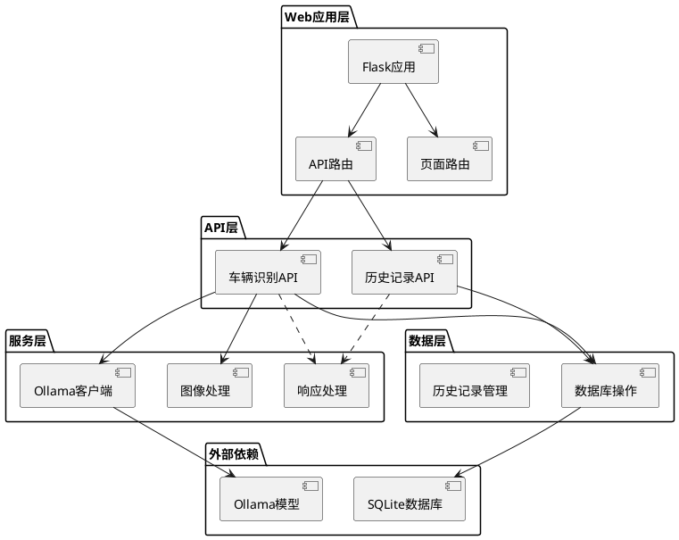
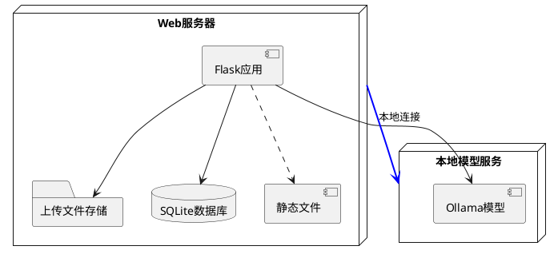

# RemakeV3_3_1项目架构PlantUML diagrams

## 逻辑视图

```plantuml
@startuml 逻辑视图

' 定义包
package "Web应用层" {
    [Flask应用] as FlaskApp
    [API路由] as APIRoutes
    [页面路由] as PageRoutes
}

package "API层" {
    [车辆识别API] as VehicleAPI
    [历史记录API] as HistoryAPI
}

package "服务层" {
    [Ollama客户端] as OllamaClient
    [图像处理] as ImageProcessing
    [响应处理] as ResponseHandler
}

package "数据层" {
    [数据库操作] as DBOperations
    [历史记录管理] as HistoryManagement
}

package "外部依赖" {
    [Ollama模型] as OllamaModel
    [SQLite数据库] as SQLiteDB
}

' 定义关系
FlaskApp --> APIRoutes
FlaskApp --> PageRoutes

APIRoutes --> VehicleAPI
APIRoutes --> HistoryAPI

VehicleAPI --> OllamaClient
VehicleAPI --> ImageProcessing
VehicleAPI --> DBOperations

HistoryAPI --> DBOperations

OllamaClient --> OllamaModel
DBOperations --> SQLiteDB

' 定义依赖
VehicleAPI ..> ResponseHandler
HistoryAPI ..> ResponseHandler

@enduml
```

## 部署视图

```plantuml
@startuml 部署视图

' 定义节点
node "Web服务器" as WebServer {
    component "Flask应用" as FlaskApp
    component "静态文件" as StaticFiles
    folder "上传文件存储" as UploadsFolder
    database "SQLite数据库" as SQLiteDB
}

node "本地模型服务" as ModelServer {
    [Ollama模型] as OllamaModel
}

' 定义关系
FlaskApp --> SQLiteDB
FlaskApp --> OllamaModel
FlaskApp --> UploadsFolder

' 定义依赖
FlaskApp ..> StaticFiles

' 定义网络连接
WebServer -[#blue,thickness=2]-> ModelServer : 本地连接

@enduml
```